## Analysis of an Ordinary Differential Equation (ODE)

All the figures below are generated using `examples/ode/ode.jl`.

### ODE

$$x''(t) = -\omega^2 * x(t) - k * x'(t)$$

#### Unknown ODE parameters

* k
* $\omega$

#### Example ODE solution

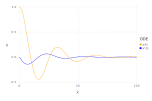

For model parameters:

* k = 0.1
* $\omega$ = 0.2

### Local sensitivity analysis

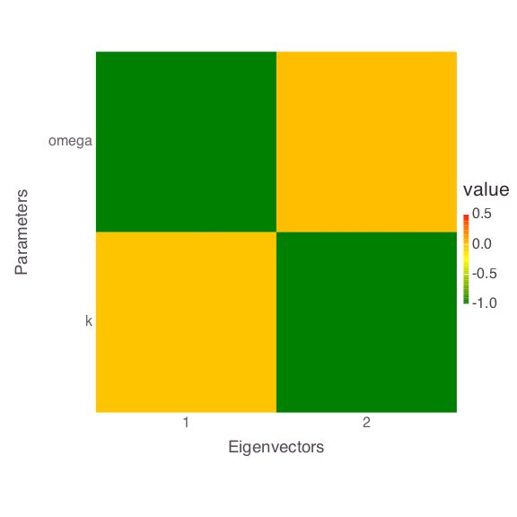

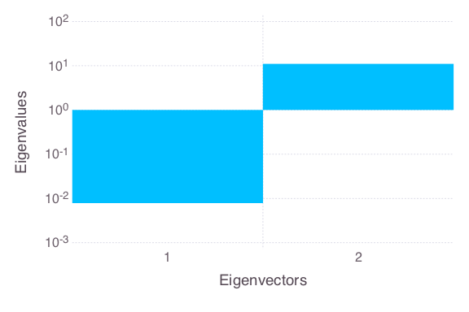

### Global sensitivity analysis (using eFAST)

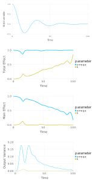

Probabilistic distributions of the prior parameter uncertainties are:

* k = LogUniform(0.01, 0.1)
* $\omega$ = Uniform(0.1, 0.3)

### Bayesian sensitivity analysis

#### Observations

Synthetic observations are applied to constrain the ODE parameters

Observation errors are equal for all the sample locations with standard deviation equal to 1 (`observation weight` =  1 / `observation standard deviation` = 1 / 1 = 1)

#### Prior parameter uncertainties

##### *k* only

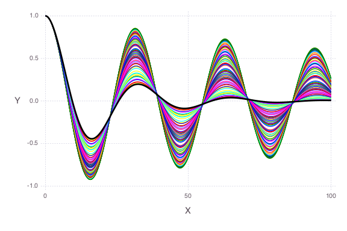

##### *$\omega$* only

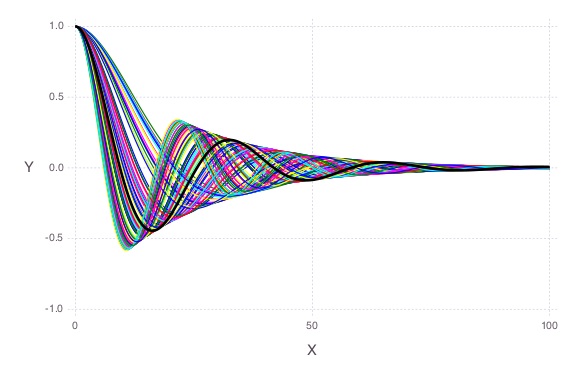

##### *Both* parameters

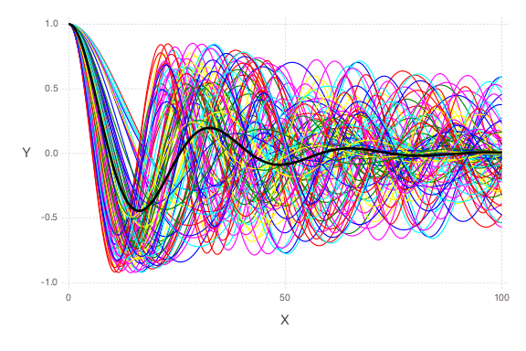

The observation data are plotted as a solid black line.

#### Histograms/scatter plots of Bayesian MCMC results

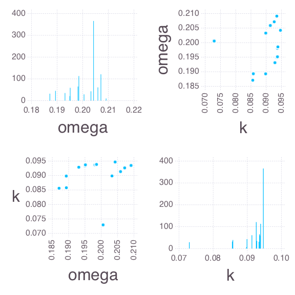

#### Posterior parameter uncertainties

Note that now the parameter uncertainties are constrained by the observation data

##### *k* only

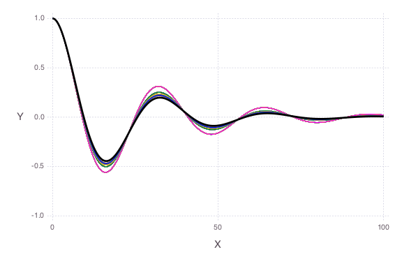

##### *$\omega$* only

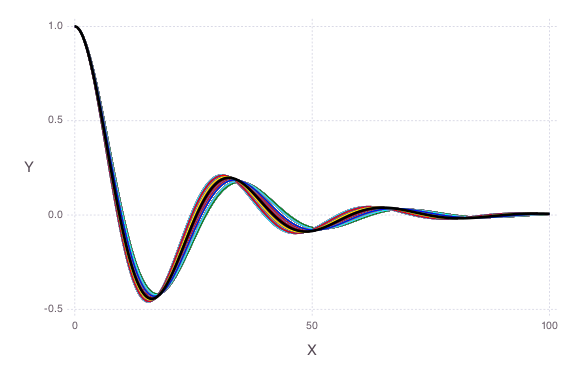

##### *Both* parameters

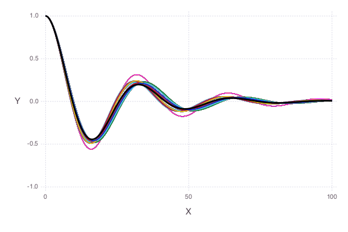

The observation data are plotted as a solid black line.